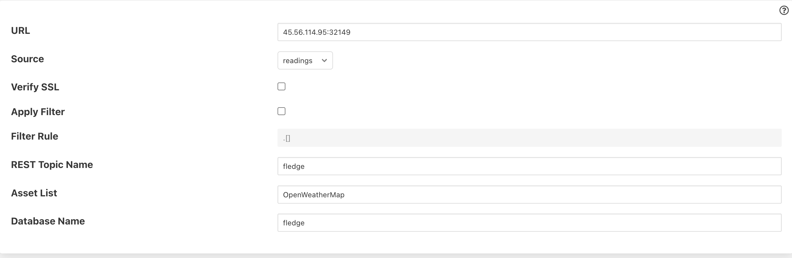
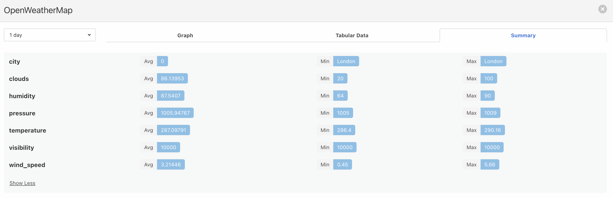

# Fledge

The following code is based on [fledge-http-north](https://github.com/fledge-iot/fledge-north-http), but instead of 
sending data between FLEDGE nodes, it allows sending data into AnyLog via REST POST. The main difference between two 
plugins are: 
1. `plugin_send` checks that there's a correlation between the declared asset(s) and the topic they're sent to. If
no assets are declared in the configuration, then all assets will be sent against the given topic.  
2. `_send_payloads` has an updated REST _header_, which is supported by AnyLog; rather than the one used between FLEDGE    
nodes.

## Deployment & Configuring on the Fledge Side
0. [Deploy FLEDDGE](https://fledge-iot.readthedocs.io/en/latest/quick_start/index.html) 

1. Copy [anylog_rest_conn](fledge_north_anylog_http) into the `plugins/north` FLEDGE directory.
```bash
sudo cp -r $HOME/lfedge-code/fledge/anylog_rest_conn/ /usr/local/fledge/python/fledge/plugins/north 
```

2. Begin sending data & view `readings` columns. - We'll be using the OpenWeatherMap asset as an example
```json
# Sample data being generated
{
 "asset": "OpenWeatherMap",
 "reading": {
   "city": "London",
   "wind_speed": 5.14,
   "clouds": 100,
   "temperature": 289.21,
   "pressure": 1009,
   "humidity": 74,
   "visibility": 10000
 },
 "timestamp": "2022-06-25 19:42:09.916403"
}
```

3. Under the _North_ section add `anylog_rest_conn` 
   * **URL** - The IP:Port address to send data to
   * **REST Topic Name** - REST topic to send data to
   * **Asset List**: - Comma separated list of assets to send using this AnyLog connection. If no assets set, then data 
   from all assets will be sent
   * **Database Name** - logical database to store data in AnyLog


At this point data will sent into AnyLog via REST. 


## Configuring AnyLog REST Client
1. On FLEDGE check the readings you're sending into AnyLog - in this case OpenWeather data


2. locate the `local_scripts` directory
```bash
docker volume inspect anylog-node_anylog-node-local-scripts 
[
    {
        "CreatedAt": "2022-06-24T17:42:57Z",
        "Driver": "local",
        "Labels": {
            "com.docker.compose.project": "anylog-node",
            "com.docker.compose.version": "1.29.2",
            "com.docker.compose.volume": "anylog-node-local-scripts"
        },
        "Mountpoint": "/var/lib/docker/volumes/anylog-node_anylog-node-local-scripts/_data",
        "Name": "anylog-node_anylog-node-local-scripts",
        "Options": null,
        "Scope": "local"
    }
]
```

3. vim into `/var/lib/docker/volumes/anylog-node_anylog-node-local-scripts/_data/local_script.al`
```bash 
vim /var/lib/docker/volumes/anylog-node_anylog-node-local-scripts/_data/local_script.al
```

4. Update file
```anylog
# The following file is intended as a placeholder for user implemented code. The file is automatically called by master,
# operator, publisher, query or single_node (operator / publisher) files. If not is written then nothing runs.
#
# Sample commands could include things like;
#   * complicated MQTT calls
#   * Kafka requests
#   * non-standard schedule processes, such as recording disk usage and automated queries
#
# Documentation: https://github.com/AnyLog-co/documentation
#-----------------------------------------------------------------------------------------------------------------------
# process !anylog_path/AnyLog-Network/scripts/local_script.al

<run mqtt client where broker=rest and port=!anylog_rest_port and user-agent=anylog and log=false and topic=(
   name=fledge and
   dbms="bring [dbms]" and
   table="bring [asset]" and
   column.timestamp.timestamp="bring [timestamp]" and
   column.city=(type=str and value="bring [readdings][city]") and
   column.wind_speed=(type=float and value="bring [readdings][wind_speed]") and
   column.clouds=(type=float and value="bring [readdings][clouds]") and
   column.temperature=(type=float and value="bring [readdings][temperature]") and
   column.humidity=(type=float and value="bring [readdings][humidity]") and
   column.visibility=(type=float and value="bring [readdings][visibility]") and
)>
```

5. Execute `local_script.al` against AnyLog 
```bash 
# Within AnyLog User-CMD 
process  !anylog_path/AnyLog-Network/scripts/local_script.al

# via cURL 
curl -X POST ${IP}:${REST_PORT} -H "command: process /app/AnyLog-Network/scripts/local_script.al" -H "User-Agent: AnyLog/1.23"
```

6. Update configuration file to have `DEPLOY_LOCAL_SCRIPT` set to true so that in the future the script will run automatically.


